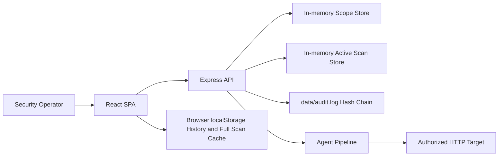
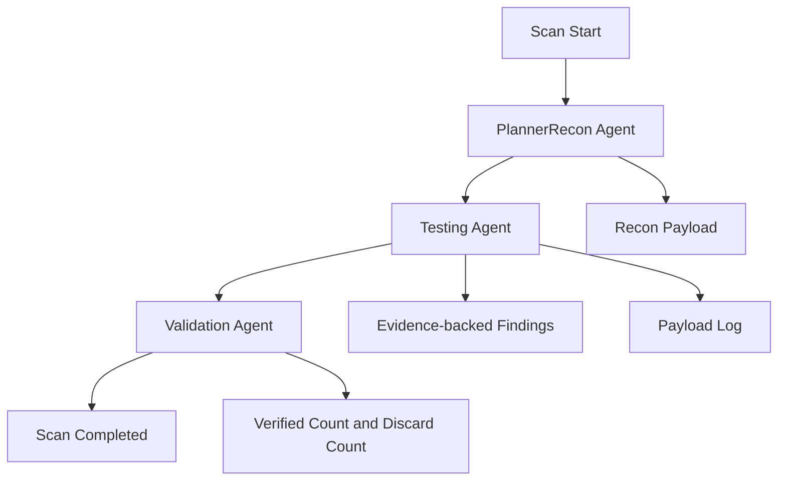
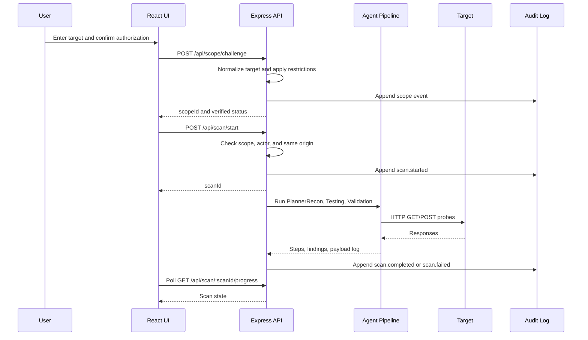
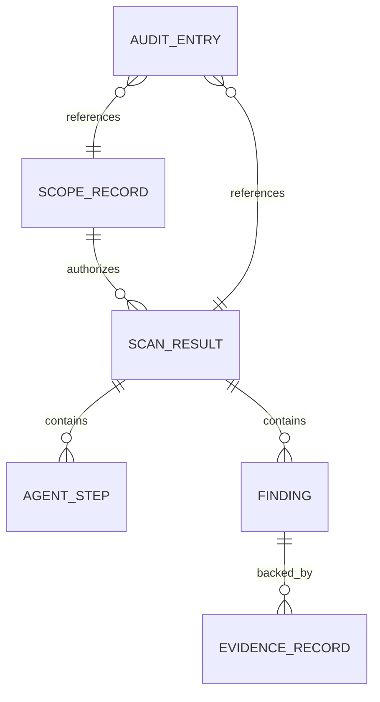
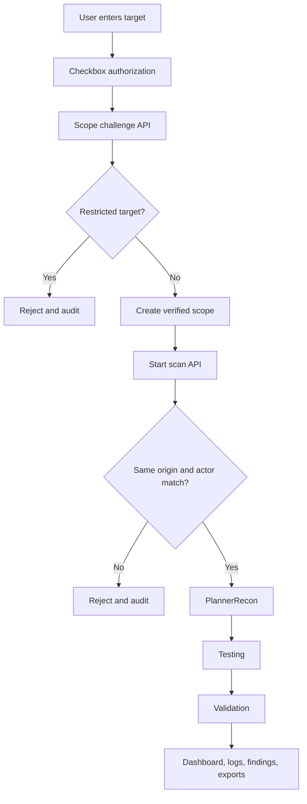
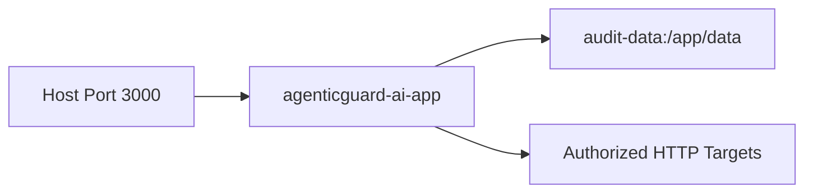

# AgenticGuard Project Report

## Project Overview


| Attribute | Description |
| --- | --- |
| Project name | AgenticGuard AI / AgenticGuard |
| Repository type | Local full-stack TypeScript security assessment application |
| Primary interface | React single-page application served by an Express backend |
| Backend runtime | Node.js with Express and Vite middleware/static serving |
| Assessment focus | Authorized web, API, LLM, MCP, and agentic AI security assessment |
| Deployment support | Local development, Docker Compose, optional lab stack, and a single-container Kubernetes manifest |
| Persistence model | In-memory backend scan/scope state, browser localStorage for UI history, file-based hash-chained audit log |
| Current maturity | Functional local assessment platform; not yet a full production SaaS architecture |

AgenticGuard is an authorized security assessment platform focused on web applications, APIs, AI applications, LLM-facing endpoints, MCP surfaces, and agentic AI workflows. The application provides a browser dashboard for starting scans, viewing running scan status, inspecting evidence-backed findings, reviewing payload logs, exporting JSON, and printing executive-style PDF reports through the browser print flow.

The project exists to help security teams validate whether owned systems expose common web security weaknesses, API inventory issues, security header gaps, LLM prompt-injection behaviors, MCP metadata exposure, agentic AI goal and tool misuse patterns, memory poisoning risks, unsafe AI output handling, identity delegation weaknesses, and related AI security concerns. The implemented scanner is bounded and evidence-driven. It does not fabricate findings without HTTP request and response evidence. The validation step explicitly filters out findings that do not include evidence records.

The current application is best understood as a working local security assessment product with a modern UI, concurrent scan tracking, evidence handling, and deployable container packaging. It is not yet the production SaaS stack described in earlier product goals. The codebase does not include PostgreSQL models, Redis queues, Celery workers, enterprise SSO, MFA, RBAC administration, object storage, real multi-tenant database isolation, or signed report generation. Those areas should be treated as future production hardening work.


### Product Summary

AgenticGuard allows an operator to:

- Enter a URL, IP-based HTTP endpoint, internal Docker service name, API endpoint, or lab target.
- Confirm ownership or authorization using a checkbox attestation flow.
- Start one or more scans.
- Observe scan execution through a live dashboard and log view.
- Review findings grouped by severity.
- See request/response evidence, payloads, timestamps, mappings, and remediation guidance.
- Export the selected scan as JSON.
- Print a filtered executive PDF report using the browser print dialog.
- Review local scan history persisted in browser storage.

### Primary Purpose

The primary purpose is to make authorized security assessment of web and AI/agentic systems easier to operate and easier to explain. It combines scanner execution, evidence collection, risk scoring metadata, OWASP-style mapping, payload visibility, and executive-friendly reporting in one local product surface.

### Key Capabilities

Implemented capabilities include:

- Scope creation through checkbox ownership attestation.
- Restricted-target blocking for high-risk categories.
- Same-origin enforcement between verified scope and scan target.
- Passive reconnaissance of common web, API, AI, and MCP discovery paths.
- Bounded active web checks against same-origin URLs.
- AI and agentic endpoint probing with safe canary-style payloads.
- Controlled proof checks for local/training-style targets.
- Evidence-backed finding validation.
- Hash-chained audit logging.
- Dashboard aggregation across current scans and locally persisted scan history.
- Severity distribution chart.
- Resource-type classification.
- AI-agent-surface counting based on AI/LLM/MCP/agentic findings.
- Live logs page with execution trace and payload snippets.
- JSON export and browser-print PDF reporting.
- Optional vulnerable AI lab and optional OWASP Juice Shop container for scanner validation.

### Business Value

AgenticGuard reduces the manual effort required to discover and communicate security risks in web and AI-enabled applications. Its business value comes from consolidating several security tasks into one workflow: target intake, authorization attestation, scanner execution, evidence capture, finding normalization, severity grouping, and report export. For executives and security leaders, it creates a repeatable evidence trail and a structured view of risk. For developers and AppSec teams, it exposes concrete request/response evidence and remediation advice that can be acted upon.

## Executive Summary

AgenticGuard is a local security assessment platform for authorized testing of web, API, LLM, MCP, and agentic AI targets. It provides an operator-facing UI where security users can start scans with a checkbox authorization statement, monitor execution, review findings, inspect payloads, and export reports. The backend orchestrates a small agent pipeline consisting of planning/reconnaissance, testing, and validation. The scanner collects live HTTP responses from the target, performs bounded active checks, constructs evidence-backed findings, and discards unsupported findings.

The platform is primarily intended for security teams, application security teams, red teams, cloud security teams, developers, administrators, and compliance stakeholders who need fast visibility into security posture across owned applications and AI systems. It is especially relevant for teams exploring agentic AI risks because it includes checks aligned to Agentic AI categories such as goal hijacking, tool misuse, identity and privilege abuse, memory poisoning, inter-agent spoofing, cascading failure, human-agent trust exploitation, and rogue autonomy.

The major differentiator in the implemented codebase is the evidence-first scanner workflow. Findings are generated only when the scanner has captured request and response evidence. The validation agent enforces this rule by filtering out findings without evidence records. The UI then surfaces evidence, payloads, timestamps, severity, OWASP mapping, and remediation in a format usable by both technical and executive audiences.

At the same time, the codebase should not be described as a complete enterprise SaaS. Authentication is represented by local/default request headers rather than a real identity provider. Authorization is limited to in-memory scope ownership checks. Scans run in-process rather than through a durable queue. Backend state is held in memory. The UI stores scan history in browser localStorage. Audit logs are file-based and tamper-evident through a hash chain, but not tamper-proof. The Kubernetes manifest deploys a single app container and persistent volume claim; it does not define a full multi-service production architecture.

## Why It Matters in the Age of Agentic AI

Agentic AI changes the security model for modern software. Traditional applications typically wait for user requests, process data, and return responses. Agentic systems may plan tasks, call tools, update goals, write memory, retrieve context, communicate with other agents, and take actions across internal or external systems. That shift increases business value, but it also expands the ways an attacker or misconfigured workflow can cause harm.

In a conventional web application, a vulnerability may expose a page, endpoint, session, or database query. In an agentic application, the same vulnerability can become a decision-making problem. A prompt injection may not only alter text output; it may redirect a goal, trigger a tool, poison memory, leak hidden instructions, or influence a human operator. An authorization weakness may not only expose one object; it may allow a delegated agent to act with excessive authority. A weak MCP or tool manifest may not only reveal metadata; it may advertise capabilities an attacker can attempt to misuse.

AgenticGuard matters because it focuses on these agentic boundaries as first-class security concerns. The implemented scanner does not treat AI security as a generic prompt check only. It includes targeted checks for MCP exposure, AI tool metadata, prompt injection behavior, goal hijacking, tool misuse, identity delegation, memory poisoning, RAG leakage, inter-agent message trust, cascading failure, trust manipulation, rogue autonomy, insecure output handling, sensitive AI information disclosure, and model extraction control gaps.

The product also matters because executive teams increasingly need evidence that AI systems are being assessed with the same rigor as traditional software. A security leader cannot responsibly accept a dashboard that invents findings or summarizes unsupported claims. The current implementation addresses this by requiring request and response evidence for every reportable issue. This evidence-first design is especially important in AI security, where weak prompts, vague model behavior, and speculative risk statements can otherwise produce noisy or unreliable reports.

For engineering teams, the value is practical. Developers need to know what endpoint was called, what payload was sent, what response came back, and why that behavior matters. AgenticGuard captures payloads, response status, evidence records, mappings, and remediation guidance. This makes agentic AI findings easier to reproduce, triage, and fix.

For executives, the value is clarity. Agentic AI introduces new operational and governance risks that are difficult to explain using only traditional vulnerability language. AgenticGuard presents findings by severity, groups affected assets and vulnerabilities, counts AI agent surfaces, and supports filtered executive PDF export. This allows leadership to understand the risk posture without losing the technical evidence required by security and engineering teams.

## Competitive Advantage

AgenticGuard's competitive advantage, based on the current implementation, is its combination of conventional web/API assessment, AI/LLM probing, agentic AI risk checks, evidence validation, payload visibility, and executive reporting in a single local workflow.

| Advantage | Why it matters | Current implementation evidence |
| --- | --- | --- |
| Evidence-first findings | Reduces false or unsupported reporting and improves developer trust. | `validateEvidenceBackedFindings()` discards findings without request/response evidence. |
| Agentic AI-specific coverage | Moves beyond generic web scanning into goal, tool, memory, identity, inter-agent, and autonomy risks. | AI/agentic checks in `runAiAgenticChecks()`. |
| Operator-visible payloads | Helps teams understand what the scanner actually did and monitor test behavior. | Payload Monitor and Execution Timeline payload snippets. |
| Executive and technical reporting | Serves security engineers and leadership from the same scan result. | JSON export and browser-print Executive PDF flow. |
| Low-friction local workflow | Supports rapid validation in owned development, Docker, and lab environments. | Checkbox attestation in `ScopeManager.tsx` and `/api/scope/challenge`. |
| Optional validation labs | Allows repeatable scanner validation without relying on public external targets. | `docker-compose.labs.yml`, Juice Shop, and vulnerable AI lab. |
| Safety-conscious active checks | Avoids uncontrolled destructive behavior while still collecting useful evidence. | Bounded paths, timeouts, controlled proof gating, and non-destructive probes. |
| Auditability | Creates a local tamper-evident event trail for scope and scan actions. | Hash-chained `data/audit.log` entries. |

This positioning is strongest for organizations that need a practical way to start validating AI and agentic security posture without immediately deploying a large enterprise platform. Its current differentiation is less about being a complete production SaaS and more about showing a coherent product direction: evidence-backed AI security assessment with usable reporting and operator transparency.

The main competitive gap is enterprise readiness. Larger commercial security platforms usually include durable databases, multi-tenant administration, user management, SSO, RBAC, distributed workers, integrations, and centralized evidence storage. AgenticGuard does not yet include those capabilities. Its advantage today is focused scanner logic and product experience; its future advantage depends on hardening the architecture into a durable SaaS platform.

## Market Positioning

AgenticGuard sits at the intersection of application security testing, AI security validation, agentic AI governance, and evidence-backed red-team reporting. The market need is emerging because enterprises are adopting LLM applications, tool-calling agents, MCP servers, RAG systems, and autonomous workflows faster than many security programs can create reliable assessment coverage.

### Positioning Statement

AgenticGuard is an evidence-backed security assessment platform for organizations building and operating web, API, LLM, MCP, and agentic AI systems. It helps security teams identify traditional and AI-specific risks, validate findings with captured request/response evidence, and communicate remediation priorities through technical and executive reports.

### Primary Market Segments

| Segment | Need | Fit |
| --- | --- | --- |
| AI product companies | Validate LLM, MCP, tool, memory, and agent workflows before customer deployment. | Strong conceptual fit; production hardening required for SaaS use. |
| Enterprise AppSec teams | Add AI/agentic checks to existing web/API security workflows. | Strong fit for local/dev validation and future platform integration. |
| Red teams and AI security teams | Run repeatable checks against authorized AI applications and labs. | Strong fit for evidence-backed local testing. |
| Compliance and governance teams | Demonstrate that AI systems are assessed and findings are traceable. | Good reporting fit; compliance mappings should be expanded. |
| Developer platform teams | Provide internal teams with fast validation for owned services. | Good fit for development environments. |

### Market Category

AgenticGuard can be positioned across several adjacent categories:

- AI security testing.
- Agentic AI red-team automation.
- Application security testing for AI-enabled applications.
- MCP and tool-surface assessment.
- Evidence-backed security reporting.
- Internal security validation platform.


### Differentiation Against Traditional Scanners

Traditional web vulnerability scanners generally focus on HTTP application behavior, known vulnerability signatures, crawlable routes, headers, injection classes, authentication weaknesses, and configuration issues. AgenticGuard includes some of those checks, but its market positioning is differentiated by agentic AI coverage. It tests whether AI-like endpoints expose tool metadata, accept prompt-injection canaries, update goals, execute tools, trust spoofed agent messages, expose memory, or expand autonomous scope.

### Differentiation Against Manual AI Red Teaming

Manual AI red teaming is flexible but expensive, inconsistent, and difficult to scale. AgenticGuard provides a repeatable scanner workflow and a consistent evidence model. It does not replace expert manual testing, but it can standardize baseline checks and provide initial findings that specialists can expand upon.

### Market Readiness Caveat

The current implementation is not yet a fully commercial SaaS platform. Its strongest current market fit is internal validation, product demonstration, early customer pilots in controlled environments, and scanner development. Full market readiness requires the high-priority enhancements documented later in this report, especially identity, RBAC, durable storage, queued workers, immutable evidence storage, and enterprise deployment controls.

## Business Problem Solved

Modern organizations increasingly deploy applications that combine traditional web/API surfaces with AI behaviors, LLM endpoints, tool-calling agents, MCP servers, memory stores, RAG retrieval, and autonomous workflows. These systems create new attack surfaces that do not fit neatly into older vulnerability management workflows. Security teams need to answer questions such as:

- Does this application expose weak HTTP security headers?
- Are public API schemas or admin metadata reachable?
- Are there endpoints that look like MCP or AI tool manifests?
- Can prompt injection probes influence LLM-style responses?
- Can an agent goal be changed by untrusted input?
- Can tools be invoked without authorization?
- Are memory or RAG endpoints isolated?
- Are agent-to-agent messages authenticated?
- Are findings backed by evidence that developers can reproduce?

AgenticGuard addresses these problems by combining conventional web/API checks with AI and agentic security checks in a single scan workflow. It does not replace a full enterprise vulnerability management program, but it provides immediate assessment value for development and validation environments.

### Industry Problems

Security programs face several recurring gaps:

| Problem | Effect |
| --- | --- |
| AI systems expose nontraditional attack surfaces | Standard scanners may miss prompt, tool, memory, and agent-specific risks. |
| Evidence is often fragmented | Teams struggle to prove what was tested and what response was observed. |
| Manual red-team workflows are slow | Repeated checks across development targets consume analyst time. |
| Reporting formats differ by audience | Engineers need payloads and traces; executives need risk summaries. |
| Cloud and internal development targets change quickly | Heavy ownership verification workflows can be burdensome in local/dev settings. |
| Agentic AI controls are immature | Many teams lack repeatable tests for goal, tool, memory, identity, and autonomy boundaries. |

### Risk Reduction

The implemented platform reduces risk by:

- Detecting missing security headers and configuration weaknesses.
- Identifying public metadata, schemas, challenge, file repository, and dependency manifest surfaces.
- Detecting SQL error patterns caused by simple input probes.
- Detecting reflected input markers that require follow-up XSS context review.
- Identifying SSRF-relevant URL-fetch surfaces without exploiting internal networks.
- Probing AI endpoints with safe canary-style payloads.
- Finding MCP/tool metadata exposures.
- Detecting agentic AI behaviors in intentionally vulnerable or similarly implemented targets.
- Ensuring reported issues have captured evidence records.
- Producing remediation guidance with each finding.

### Efficiency Gains

AgenticGuard improves operational efficiency by automating a repeatable scan pipeline. A user does not need to manually assemble curl commands, record evidence, map findings to categories, and build a report. The UI consolidates the scan queue, dashboard, findings, payload monitor, live logs, history, and export actions.

## Target Users

| User group | Benefits |
| --- | --- |
| Security teams | Obtain repeatable evidence-backed assessment results across web/API/AI targets. |
| AppSec teams | Review specific findings, payloads, evidence, and remediation guidance for developer handoff. |
| Cloud security teams | Test reachable HTTP services, internal Docker services, and cloud application endpoints when authorized. |
| Red teams | Validate AI and agentic behaviors with bounded, documented probes and payload traces. |
| Developers | Reproduce findings from captured request URLs, methods, payloads, response status, and response samples. |
| Administrators | Configure local trust policy, Docker deployment, Kubernetes deployment, and audit log persistence. |
| Compliance teams | Use evidence-backed reports and OWASP/NIST/MITRE mappings to support control discussions. |
| Executives | Review high-level risk posture and severity-filtered printable reports. |

## Product Capabilities

### Scope Intake and Authorization Attestation

**Description:** The Scope Manager UI accepts a target URL and owner email. The user must check a confirmation box stating that they own or are authorized to assess the target. The frontend sends a scope challenge request with `verificationMethod: "attestation"`.

**Purpose:** Provide a low-friction local authorization flow for owned targets and development environments.

**Workflow:**

1. User enters target.
2. User enters owner email.
3. User checks authorization statement.
4. UI sends `POST /api/scope/challenge`.
5. Backend normalizes the target and applies restricted-target checks.
6. Backend creates a scope record and marks it verified for attestation.
7. UI starts the scan using returned `scopeId`.

**Benefits:** Fast local scanning while still recording user/tenant attribution and audit events.

**Status:** Implemented for local attestation. DNS/file/API verification functions exist and `/api/scope/verify` exists, but the current UI uses attestation only. Admin approval returns a pending response and is not a complete approval workflow.

### Restricted Target Blocking

**Description:** The backend rejects hostnames matching heuristic patterns for government, military, emergency services, banking/payment systems, healthcare, and critical infrastructure.

**Purpose:** Reduce risk of accidental or inappropriate scanning of sensitive sectors.

**Workflow:** During scope creation and scan start, `isRestrictedTarget()` evaluates the hostname. If a match exists, the backend logs `scope.rejected` or `scan.rejected` and returns HTTP 403.

**Benefits:** Adds a hard stop before active scanner traffic is generated.

**Status:** Implemented as heuristic hostname pattern matching. The threat model correctly identifies this as conservative and not a full enterprise policy engine.

### Same-Origin Enforcement

**Description:** The scan target must match the verified scope origin exactly.

**Purpose:** Prevent scope escalation from one authorized origin to another.

**Workflow:** `/api/scan/start` compares `targetUrl` and the stored scope URL using `sameOrigin()`. Protocol, hostname, and port must match.

**Benefits:** Keeps scanner activity within the attested scope.

**Status:** Implemented.

### Concurrent Scan Tracking

**Description:** The frontend supports multiple scans in a scan queue. The backend stores active scans in an in-memory `Map`.

**Purpose:** Allow users to start additional scans without waiting for prior scans to complete.

**Workflow:** Each scan receives a `scanId`; the UI polls `/api/scan/:scanId/progress` every two seconds for active scans.

**Benefits:** Improves usability for multiple targets.

**Status:** Implemented locally. Not durable across backend restart.

### Passive Reconnaissance

**Description:** The planner/recon agent sends GET requests to common paths such as `/`, `/robots.txt`, `/sitemap.xml`, `/openapi.json`, `/swagger.json`, `/.well-known/ai-plugin.json`, `/.well-known/mcp.json`, `/mcp`, Juice Shop-related endpoints, and `/ftp`.

**Purpose:** Build initial target evidence, detect technologies, inventory endpoints, and identify API/MCP/AI/agent surfaces.

**Workflow:** `runCombinedPlannerReconAgent()` normalizes the target, calls `passiveRequest()` for each path, records response status, headers, body sample, timestamp, security headers, technologies, and attack surface inventory.

**Benefits:** Establishes evidence before active checks and provides graceful unreachable-target evidence.

**Status:** Implemented.

### Bounded Active Web Checks

**Description:** The testing agent performs same-origin active discovery and non-destructive checks against a bounded URL set.

**Purpose:** Identify web and API risks beyond passive headers.

**Implemented checks include:**

- Server error and verbose error signals.
- Public file repository exposure.
- Unauthenticated application configuration exposure.
- Sensitive path exposure such as `/.env` and `/api/secrets`.
- Public dependency manifests.
- External script without Subresource Integrity.
- SSRF-relevant URL-fetch surface indicators.
- Unauthenticated challenge metadata.
- Scoreboard/challenge progress surface exposure.
- Reflected input marker.
- SQL error pattern from a single quote payload.

**Benefits:** Provides concrete evidence for common application risks while avoiding broad fuzzing or uncontrolled exploitation.

**Status:** Implemented.

### AI, LLM, MCP, and Agentic Checks

**Description:** The scanner discovers and probes candidate AI paths such as `/api/chat`, `/api/agent`, `/api/tool`, `/api/memory`, `/api/rag/query`, `/api/identity/delegate`, `/api/agent/message`, `/api/agent/loop`, `/api/trust/recommendation`, `/api/agent/autonomy`, `/api/output/render`, `/api/model/extract`, `/.well-known/mcp.json`, and `/mcp`.

**Purpose:** Assess AI and agentic behavior using safe scanner canaries and dry-run fields.

**Implemented finding types include:**

- Unauthenticated AI tool or MCP metadata exposure.
- LLM prompt injection probe reflected or acted on.
- Agent goal hijacking accepted.
- Agent tool misuse accepted without authorization.
- Agent memory poisoning accepted.
- RAG memory exposed across queries.
- Identity delegation accepted without authorization.
- Inter-agent message spoofing accepted.
- Cascading failure guard missing.
- Human-agent trust exploitation accepted.
- Rogue agent scope expansion accepted.
- Insecure AI output handling.
- Model extraction controls missing.
- Sensitive AI system information disclosure.

**Benefits:** Gives teams a repeatable way to validate core agentic AI security boundaries.

**Status:** Implemented for HTTP-accessible endpoints that respond with matching evidence. It is not a general LLM model evaluation framework and does not integrate with external model providers in the scanner workflow.

### Controlled Proof Checks

**Description:** Controlled proofs are gated by `AGENTICGUARD_ENABLE_CONTROLLED_PROOFS`. The default is `local`, which enables controlled proofs for local, private, internal, and lab-style targets.

**Implemented checks include:**

- File upload surface detection without uploading a file.
- Client-accessible asset scan for code execution sink indicators.
- Known Juice Shop training credential check when controlled proofs are enabled.
- Harmless canary feedback mutation against Juice Shop-style captcha/feedback endpoints.

**Purpose:** Provide stronger evidence in controlled environments without broad brute forcing, arbitrary uploads, shell execution, or rate-limit bypass.

**Status:** Implemented with bounded behavior.


### Evidence Validation

**Description:** `validateEvidenceBackedFindings()` keeps only findings with one or more evidence records where request URL, method, response status, and timestamp exist. It also deduplicates by finding title and first evidence URL.

**Purpose:** Prevent unsupported findings from being reported.

**Benefits:** Increases trust in the output and reduces hallucinated or speculative findings.

**Status:** Implemented and tested.

### Audit Logging

**Description:** The backend appends audit events to `data/audit.log`. Each entry includes event name, actor, details, timestamp, previous hash, and hash.

**Purpose:** Maintain a tamper-evident local audit trail of scope and scan events.

**Events include:**

- `scope.rejected`
- `scope.attested.policy_verified`
- `scope.challenge.created`
- `scope.verify.failed`
- `scope.verified`
- `scan.started`
- `scan.completed`
- `scan.failed`
- `scan.rejected`

**Status:** Implemented as local file-based hash chaining. It is not immutable storage.

### Dashboard and Reporting

**Description:** The React dashboard shows running scans, total findings, scanned resources, AI agent surfaces, scan runs, severity distribution, resource types, scan queue, grouped risk view, report export, payload monitor, findings list, and execution trace.

**Grouping modes include:**

- Scan
- Asset
- Vulnerability

**Export modes include:**

- JSON download for selected scan.
- Browser print flow for executive PDF, with severity filtering.

**Status:** Implemented.

## Architecture Overview

### High-Level Architecture



The application is a single Node.js process in both development and production. In development, Express uses Vite middleware. In production, Vite builds static assets into `dist`, and Express serves them.

### Frontend Architecture

The frontend is a React application in `src/`. It uses:

- React 19.
- Tailwind CSS styling.
- Framer Motion for transitions.
- Recharts for severity distribution.
- Lucide React icons.
- Browser localStorage for scan history, full scan cache, and theme preference.

Key files:

| File | Purpose |
| --- | --- |
| `src/App.tsx` | Main application state, scan polling, dashboard, logs, exports, grouped views. |
| `src/components/Layout.tsx` | Sidebar, navigation, theme toggle, top header. |
| `src/components/ScopeManager.tsx` | Target input and ownership attestation workflow. |
| `src/components/DashboardOverview.tsx` | Severity chart, totals, resource type panel. |
| `src/components/ExecutionTimeline.tsx` | Agent step trace and payload snippets. |
| `src/components/FindingsList.tsx` | Severity-grouped findings and expandable evidence/remediation. |
| `src/components/ScanHistory.tsx` | Local historical scan registry. |
| `src/index.css` | Tailwind imports, theme overrides, print/PDF styling. |

### Backend Architecture

The backend is implemented in `server.ts` and supporting modules under `server/`.

Key backend responsibilities:

- Parse JSON requests.
- Infer actor from `x-user-id` and `x-tenant-id` headers, defaulting to local values.
- Create and verify scope records.
- Enforce restricted target and same-origin policy.
- Start asynchronous in-process scans.
- Return scan progress.
- Append audit logs.
- Serve the frontend.

Backend state is held in:

- `scopeStore`: `Map<string, ScopeRecord>`
- `activeScans`: `Map<string, ScanResult>`
- `previousAuditHash`: process-local audit hash chain state

### Agent Architecture



Agent responsibilities:

| Agent | Function |
| --- | --- |
| PlannerRecon | Collect passive HTTP evidence, detect headers, technologies, and attack surface inventory. |
| Testing | Run header checks, active web checks, AI/agentic checks, controlled proof checks, and build findings. |
| Validation | Re-validate evidence requirements and report verified/discarded counts. |

### Data Flow



## AI / Agent System

The AI/agent system in this project is implemented as deterministic TypeScript scanner functions, not autonomous LLM calls. The package includes `@google/genai` as a dependency, but the actual scanner code shown in `server/agents.ts` does not call external model providers. The "agents" are structured pipeline stages that perform HTTP reconnaissance, testing, and validation.

### Agent Types

| Agent | Implemented as | Responsibility |
| --- | --- | --- |
| PlannerRecon | `runCombinedPlannerReconAgent()` | Collect passive evidence and build attack surface inventory. |
| Testing | `runTestingAgent()` | Run web/API/AI/agentic checks and produce findings. |
| Validation | `runValidationAgent()` | Verify evidence-backed findings and produce validation summary. |

### Decision Flow

The scanner decision flow is rule-based:

1. If root is unreachable or all passive responses fail, create an informational reachability finding.
2. If root is reachable, check missing security headers and wildcard CORS.
3. Inspect passive responses for public schemas and MCP surfaces.
4. Run bounded active web checks.
5. Run AI and agentic endpoint probes.
6. Run controlled proof checks if enabled for the target.
7. Validate evidence records.
8. Produce payload logs and coverage counts.

### Safety Controls and Guardrails

Implemented guardrails include:

- HTTP/HTTPS-only targets.
- Restricted hostname category blocking.
- Same-origin enforcement.
- Tenant/user checks for scope and scan access.
- Bounded discovery path lists.
- Request timeouts.
- Redirect mode set to manual.
- Non-destructive markers for reflected input.
- Single quote SQL error check rather than broad SQL exploitation.
- File upload surface detection without file upload.
- Controlled proof gating.
- Evidence-only finding validation.
- Hash-chained audit logging.

## Security Architecture

### Authentication

**Partially Implemented.** The backend reads `x-user-id` and `x-tenant-id` request headers and defaults to `local-security-admin` and `local-tenant`. The UI displays "Security Admin" and "Authenticated Session", but there is no real login screen, SSO, MFA, signed session cookie, JWT validation, password flow, or identity provider integration in the codebase.

### Authorization

**Partially Implemented.** Authorization is enforced through:

- Actor matching on scope records.
- Actor matching on scan progress requests.
- Same-origin matching between scope and scan target.
- Restricted-target blocking.

There is no role management, permission model, RBAC table, ABAC policy engine, or admin UI.

### RBAC

**Planned / Stubbed Functionality.** No implemented RBAC model exists. The platform has local actor defaults and tenant/user checks, but no role definitions or assignment workflow.

### Scope Enforcement

Implemented controls:

- Scope records include `tenantId`, `userId`, `targetUrl`, `hostname`, `status`, `verificationMethod`, and timestamps.
- Scan start requires a verified scope.
- Scan target must match scope origin exactly.
- Scope and scan records must belong to the same actor.

### Input Validation

Implemented validation includes:

- Required URL and owner email for scope challenge.
- Supported verification method enumeration.
- URL parsing through `new URL()`.
- HTTP/HTTPS protocol enforcement.
- API verification URL same-host enforcement.
- Required `targetUrl` and `scopeId` for scan start.

### Agent Protections

Implemented protections include bounded path lists, timeouts, same-origin URL extraction, limited payload variants, evidence validation, and controlled proof gating. The scanner intentionally does not perform arbitrary shell execution, uncontrolled brute forcing, broad fuzzing, destructive mutations, rate-limit bypassing, or arbitrary file uploads.

### LLM Protections

The platform tests for LLM-related weaknesses, but it does not itself host an LLM in the main app. Implemented scanner protections include safe/dry-run payloads, canary strings, and evidence validation. The vulnerable AI lab intentionally exposes unsafe behavior for validation.

## Agentic AI Security Coverage

Coverage is based only on implemented detection logic in `server/agents.ts`.

### OWASP Top 10 Mapping

| OWASP item | Coverage status | Related logic | Validation |
| --- | --- | --- | --- |
| A01 Broken Access Control | Partially Implemented | Public file repository, scoreboard/progress surface, unauthenticated mutation proof | HTTP evidence records |
| A02 Cryptographic Failures | Partially Implemented | Sensitive data exposure at common paths | HTTP evidence records |
| A03 Injection | Partially Implemented | Reflected marker, SQL error pattern, output handling mapping | Payload response evidence |
| A04 Insecure Design | Partially Implemented | File upload surface detection | Surface evidence only; no upload |
| A05 Security Misconfiguration | Implemented for selected checks | Missing HSTS/CSP/X-Content-Type-Options, CORS, server errors | Header/status evidence |
| A06 Vulnerable and Outdated Components | Partially Implemented | Public package manifest exposure | Manifest response evidence |
| A07 Identification and Authentication Failures | Partially Implemented | Known Juice Shop training credential proof when enabled | Login response evidence |
| A08 Software and Data Integrity Failures | Partially Implemented | External script without SRI | Root HTML evidence |
| A09 Logging and Monitoring Failures | Partially Implemented | Verbose error/monitoring signals | Error response evidence |
| A10 SSRF | Partially Implemented | URL-fetch surface indicator detection | Indicator evidence; no SSRF exploitation |

### OWASP API Top 10 Mapping

| API item | Coverage status | Related logic |
| --- | --- | --- |
| API2 Broken Authentication | Partially Implemented | Weak/default Juice Shop training credential proof |
| API3 Broken Object Property Level Authorization | Partially Implemented | Application configuration exposure |
| API5 Broken Function Level Authorization | Partially Implemented | Public file/challenge surfaces and identity delegation mapping |
| API6 Unrestricted Access to Sensitive Business Flows | Partially Implemented | Canary feedback mutation proof |
| API8 Security Misconfiguration | Partially Implemented | Wildcard CORS and reflected input mapping |
| API9 Improper Inventory Management | Partially Implemented | Public OpenAPI/Swagger and challenge metadata |

Other API Top 10 categories are not explicitly implemented as dedicated checks.

### OWASP ASVS

**Partially Implemented / Mapping Not Explicit.** The codebase does not include explicit ASVS mapping tables. Several checks relate to ASVS concepts such as authentication, access control, input validation, output encoding, configuration, error handling, and API exposure, but ASVS section identifiers are not encoded in findings.

### OWASP Agentic AI Top 10

| ASI item | Coverage status | Detection logic | Validation logic |
| --- | --- | --- | --- |
| ASI01 Agent Goal Hijacking | Implemented for matching endpoints | POST `/api/agent` style payload; detect `goal updated` | Evidence-backed POST response |
| ASI02 Tool Misuse | Implemented for matching endpoints | POST `/api/tool`; detect `tool executed` | Evidence-backed POST response |
| ASI03 Identity and Privilege Abuse | Implemented for matching endpoints | POST `/api/identity/delegate`; detect `delegation accepted` | Evidence-backed POST response |
| ASI04 Agent Supply Chain | Implemented for metadata exposure | GET MCP/tool metadata; detect structured tool/MCP JSON | Evidence-backed GET response |
| ASI05 Unexpected Code Execution | Partially Implemented | Client-accessible asset indicators for execution sinks | Indicator evidence only |
| ASI06 Memory Poisoning | Implemented for matching endpoints | POST `/api/memory`; detect `memory poisoned`; RAG retrieval checks | Evidence-backed POST response |
| ASI07 Inter-Agent Security | Implemented for matching endpoints | POST `/api/agent/message`; detect `message trusted` | Evidence-backed POST response |
| ASI08 Cascading Failure | Implemented for matching endpoints | POST `/api/agent/loop`; detect `recursive plan accepted` | Evidence-backed POST response |
| ASI09 Human-Agent Trust Exploitation | Implemented for matching endpoints | POST `/api/trust/recommendation`; detect authoritative acceptance | Evidence-backed POST response |
| ASI10 Rogue Agents | Implemented for matching endpoints | POST `/api/agent/autonomy`; detect `autonomy expanded` | Evidence-backed POST response |

### OWASP Agentic AI Threat / Impact / Mitigation Tables

The following tables explain each OWASP Agentic AI risk in business and technical terms. The "AgenticGuard coverage" row is based only on implemented scanner behavior in this repository.

#### ASI01 Agent Goal Hijacking

| Dimension | Detail |
| --- | --- |
| Threat | An attacker or untrusted user input modifies an agent's objective, plan, or execution goal. |
| Business impact | The agent may act against business intent, disclose information, execute unintended tasks, or produce unsafe recommendations. |
| Technical impact | Goal state becomes user-controlled; downstream tool use, memory writes, or decision paths may inherit the compromised objective. |
| AgenticGuard coverage | Implemented for HTTP endpoints that accept `/api/agent`-style payloads and respond with goal-change indicators such as `goal updated`. |
| Evidence collected | POST request URL, payload, response status, headers, body sample, and timestamp. |
| Mitigation | Bind goals to server-side policy, separate user input from system objectives, require signed administrative approval for goal changes, and log goal transitions. |
| Residual limitation | The scanner validates observable HTTP behavior only; it does not inspect internal agent state unless exposed through responses. |

#### ASI02 Tool Misuse

| Dimension | Detail |
| --- | --- |
| Threat | An agent invokes tools without appropriate authorization, least privilege, user confirmation, tenant isolation, or policy checks. |
| Business impact | Sensitive data may be exfiltrated, expensive operations may be triggered, external messages may be sent, or business workflows may be abused. |
| Technical impact | Tool execution becomes reachable from untrusted prompts or API calls; tool permissions may exceed the agent's intended role. |
| AgenticGuard coverage | Implemented for `/api/tool`-style endpoints that accept canary tool invocation requests and return tool execution indicators. |
| Evidence collected | POST request containing tool name/arguments, response status, response body sample, and timestamp. |
| Mitigation | Enforce per-tool authorization, least-privilege tool scopes, tenant boundaries, server-side policy checks, and human confirmation for sensitive actions. |
| Residual limitation | The scanner uses dry-run/canary payloads and does not verify real external side effects such as email delivery or payment execution. |

#### ASI03 Identity and Privilege Abuse

| Dimension | Detail |
| --- | --- |
| Threat | Agents inherit excessive authority, accept unauthorized delegation, confuse user and service identities, or allow privilege escalation. |
| Business impact | Cross-user access, administrative action abuse, compliance violations, and unauthorized data access may occur. |
| Technical impact | Identity boundaries between users, tenants, agents, and tools become unclear or unenforced. |
| AgenticGuard coverage | Implemented for `/api/identity/delegate`-style endpoints that accept privilege delegation and return `delegation accepted`. |
| Evidence collected | POST request with requested role/user, response status, body sample, and timestamp. |
| Mitigation | Use signed delegation tokens, enforce RBAC/ABAC server-side, apply tenant isolation, require step-up approval for privileged delegation, and audit identity transitions. |
| Residual limitation | The scanner detects exposed delegation behavior through HTTP responses; it does not validate backend IAM configuration directly. |

#### ASI04 Agent Supply Chain

| Dimension | Detail |
| --- | --- |
| Threat | MCP servers, tool manifests, plugins, extensions, prompt repositories, or external integrations expose unsafe or excessive capabilities. |
| Business impact | Attackers may discover tools, abuse integrations, target vulnerable plugins, or manipulate the agent's operational supply chain. |
| Technical impact | Tool metadata and capability surfaces become unauthenticated inventory for attackers. |
| AgenticGuard coverage | Implemented through passive and active checks for `/.well-known/mcp.json`, `/mcp`, AI plugin manifests, and tool metadata JSON. |
| Evidence collected | GET request evidence from MCP/tool discovery paths, response status, content type, body sample, and timestamp. |
| Mitigation | Authenticate MCP and tool manifests, expose only least-privilege metadata, review plugin provenance, pin trusted versions, and monitor integration changes. |
| Residual limitation | The scanner identifies exposed metadata and surface indicators; it does not perform dependency reputation analysis or plugin source-code review. |

#### ASI05 Unexpected Code Execution

| Dimension | Detail |
| --- | --- |
| Threat | Agent-generated or user-influenced code reaches interpreters, shells, dynamic execution sinks, sandboxes, containers, or execution tools unexpectedly. |
| Business impact | Unauthorized code execution can compromise systems, data, workloads, or cloud resources. |
| Technical impact | Dynamic execution boundaries become reachable through prompts, API inputs, tool calls, or generated code. |
| AgenticGuard coverage | Partially implemented. The scanner searches client-accessible assets for code execution sink indicators such as `child_process`, `execSync`, `spawn`, `eval`, `Function`, and `vm.runIn`. |
| Evidence collected | GET response evidence from client-accessible assets containing execution-sink indicators. |
| Mitigation | Remove dynamic execution where possible, isolate code execution in hardened sandboxes, deny shell access by default, enforce strict input validation, and monitor execution tool calls. |
| Residual limitation | This is indicator-based only. The scanner does not attempt RCE exploitation, sandbox escape, or container breakout. |

#### ASI06 Memory Poisoning

| Dimension | Detail |
| --- | --- |
| Threat | Untrusted input is written to long-term memory, RAG stores, vector databases, or shared context and later influences agent behavior. |
| Business impact | Future sessions may be manipulated, incorrect recommendations may persist, tenant data may cross boundaries, or malicious instructions may become durable. |
| Technical impact | Memory lacks provenance, isolation, validation, approval, or retrieval filtering. |
| AgenticGuard coverage | Implemented for `/api/memory` and `/api/rag/query`-style endpoints that accept memory canaries or return scanner canary content across queries. |
| Evidence collected | POST request evidence for memory writes and RAG query responses, including payload, response body sample, and timestamp. |
| Mitigation | Isolate memory by tenant/user/session, validate memory writes, tag provenance, reject instruction-like memories, filter retrieval by authorization, and support memory review/deletion. |
| Residual limitation | The scanner validates observable memory/RAG API behavior; it does not inspect private vector database internals. |

#### ASI07 Inter-Agent Security

| Dimension | Detail |
| --- | --- |
| Threat | One agent accepts messages, commands, or plans from another agent without authentication, authorization, integrity checks, or replay protection. |
| Business impact | Attackers may spoof trusted orchestrators, redirect workflows, inject tasks, or manipulate multi-agent coordination. |
| Technical impact | Message trust relies on claims rather than cryptographic or service identity verification. |
| AgenticGuard coverage | Implemented for `/api/agent/message`-style endpoints that accept spoofed sender payloads and return `message trusted`. |
| Evidence collected | POST request evidence including spoofed sender, empty signature, response body sample, and timestamp. |
| Mitigation | Require signed agent messages, mTLS or service identity, replay protection, message authorization, and clear trust boundaries between agents. |
| Residual limitation | The scanner detects HTTP-level acceptance patterns; it does not validate private message bus controls. |

#### ASI08 Cascading Failure

| Dimension | Detail |
| --- | --- |
| Threat | Agent plans, loops, retries, hallucinations, or shared failures propagate across workflows without circuit breakers. |
| Business impact | Costs may spike, services may degrade, incident response may be delayed, or autonomous workflows may amplify errors. |
| Technical impact | Iteration limits, budgets, queue backpressure, failure isolation, and kill switches may be missing. |
| AgenticGuard coverage | Implemented for `/api/agent/loop`-style endpoints that accept unbounded recursive plans and return `recursive plan accepted`. |
| Evidence collected | POST request evidence with unbounded plan canary, response status, body sample, and timestamp. |
| Mitigation | Add iteration limits, cost budgets, timeouts, circuit breakers, queue backpressure, failure isolation, and operator kill switches. |
| Residual limitation | The scanner does not trigger actual resource exhaustion; it validates acceptance of unsafe loop configuration. |

#### ASI09 Human-Agent Trust Exploitation

| Dimension | Detail |
| --- | --- |
| Threat | An agent accepts false authority claims, manipulative instructions, deceptive context, or unverified recommendations and presents them as trustworthy. |
| Business impact | Users may follow unsafe recommendations, approve fraudulent actions, disclose sensitive data, or make incorrect business decisions. |
| Technical impact | Recommendation provenance, uncertainty labeling, authority validation, and human approval controls are weak or absent. |
| AgenticGuard coverage | Implemented for `/api/trust/recommendation`-style endpoints that accept authority-claim canaries and return authoritative acceptance indicators. |
| Evidence collected | POST request evidence with trust manipulation canary, response body sample, and timestamp. |
| Mitigation | Verify authoritative claims, label uncertainty, require human approval for consequential actions, log recommendation provenance, and train users on AI-assisted decision risks. |
| Residual limitation | The scanner detects acceptance patterns; it does not measure real user susceptibility. |

#### ASI10 Rogue Agents

| Dimension | Detail |
| --- | --- |
| Threat | An agent expands its scope, bypasses governance, changes autonomy level, or takes hidden actions outside approved boundaries. |
| Business impact | Unauthorized actions may affect systems, customers, data, cost, compliance, or operational trust. |
| Technical impact | Scope constraints, approval gates, runtime monitors, and policy enforcement are insufficient. |
| AgenticGuard coverage | Implemented for `/api/agent/autonomy`-style endpoints that accept scope expansion payloads and return `autonomy expanded`. |
| Evidence collected | POST request evidence with requested expanded scope, response body sample, and timestamp. |
| Mitigation | Enforce immutable scope boundaries, signed runtime policies, approval workflows, autonomy limits, continuous monitoring, and emergency disable controls. |
| Residual limitation | The scanner validates acceptance of unsafe autonomy requests; it does not observe hidden background actions unless exposed through HTTP evidence. |

## User Guide

### Installation

Prerequisites:

- Node.js compatible with the project dependencies.
- npm.
- Docker if using containerized execution.

Install dependencies:

```bash
npm install
```

Run static type checking:

```bash
npm run lint
```

Run tests:

```bash
npm test
```

Start local development:

```bash
npm run dev
```

Open:

```text
http://localhost:3000
```

### Docker Setup

Start the app:

```bash
docker compose up --build
```

Open:

```text
http://localhost:3000
```

Start optional vulnerable labs:

```bash
docker compose -f docker-compose.yml -f docker-compose.labs.yml up --build
```

Lab targets:

| Lab | Browser URL | Scanner URL |
| --- | --- | --- |
| OWASP Juice Shop | `http://localhost:3001` | `http://juice-shop:3000` |
| Vulnerable AI Lab | `http://localhost:3002` | `http://ai-lab:3002` |

### Creating Scans

1. Open the Scope Manager.
2. Enter a target URL.
3. Enter an owner email.
4. Check the authorization confirmation box.
5. Click Start Scan.
6. The UI returns to the dashboard and begins polling scan progress.

### Viewing Results

The dashboard provides:

- Running scan count.
- Total findings.
- Scanned resource count.
- AI agent surface count.
- Scan run count.
- Severity distribution chart.
- Resource type counts.
- Scan queue.
- Grouping by scan, asset, or vulnerability.
- Payload monitor.
- Severity-grouped finding list.
- Execution trace.

### Viewing Logs

Use the Live Logs navigation item or the View Logs button. The Live Logs page includes:

- Scan selector.
- Selected scan summary.
- Execution timeline.
- Payload snippets.
- Payload monitor.

### Exporting Reports

For JSON:

1. Select a completed scan.
2. Click Export JSON.
3. The browser downloads the selected scan with payload log data.

For PDF:

1. Select a scan.
2. Choose severity filters in Report Export.
3. Click Executive PDF.
4. Use the browser print dialog to save as PDF.

### Troubleshooting

| Issue | Likely cause | Action |
| --- | --- | --- |
| Target not reachable | DNS/network path unavailable from scanner runtime | Confirm hostname resolves from Docker host/container or use correct internal service URL |
| Scope rejected | Restricted target heuristic matched hostname | Use only owned non-restricted targets or adjust policy in a controlled deployment |
| No findings | Target may not expose implemented detectable issues | Review execution trace and payload log |
| History missing after browser change | History is stored in localStorage | Use same browser/profile or export JSON |
| Scan unavailable after backend restart | Backend scan state is in memory | Rerun scan; production needs durable storage |

## Administrator Guide

### User Management

**Planned / Stubbed Functionality.** There is no real user management UI or identity provider integration. The backend uses request headers or defaults for `userId` and `tenantId`.

### Role Management

**Planned / Stubbed Functionality.** There is no implemented role model or role administration.

### Configuration

Environment variables:

| Variable | Purpose | Default in Compose |
| --- | --- | --- |
| `NODE_ENV` | Runtime mode | `production` |
| `PORT` | HTTP port | `3000` |
| `AGENTICGUARD_TRUST_ALL_TARGETS` | Enables trust-all local attestation policy | `true` |
| `AGENTICGUARD_ENABLE_CONTROLLED_PROOFS` | Controls bounded proof checks | `local` |
| `AGENTICGUARD_TRUSTED_TARGETS` | Exact/wildcard/CIDR trusted target policy | `localhost,*.localhost,*.local,*.internal` |

### Monitoring

Implemented monitoring is limited to:

- UI scan status.
- Live execution trace.
- Payload monitor.
- Local Docker container status.
- File-based audit log.

No metrics endpoint, OpenTelemetry integration, centralized logging, alerting, or health-check API beyond Kubernetes readiness probe path `/` is implemented.

### Logging

Audit logs are written to `data/audit.log`. Docker Compose mounts this path through the `audit-data` volume. Kubernetes mounts a persistent volume claim at `/app/data`.

### Maintenance

Routine local maintenance includes:

- Running `npm run lint`.
- Running `npm test`.
- Rebuilding Docker image after code changes.
- Reviewing `data/audit.log`.
- Exporting scan JSON if browser localStorage should not be the only history location.

## Developer Guide

### Project Structure

| Path | Purpose |
| --- | --- |
| `server.ts` | Express API, scope management, scan orchestration, audit logging, Vite/static serving. |
| `server/agents.ts` | Scanner agents, checks, evidence model, findings, validation. |
| `server/safety.ts` | Target normalization, restricted target checks, trust policy, same-origin logic. |
| `server/safety.test.ts` | Node test suite for safety and evidence validation. |
| `src/` | React frontend. |
| `labs/vulnerable-ai-lab/server.mjs` | Intentionally vulnerable AI/agentic lab target. |
| `docker-compose.yml` | Main app Compose stack. |
| `docker-compose.labs.yml` | Optional labs override. |
| `Dockerfile` | Multi-stage Node build/runtime image. |
| `k8s/agenticguard.yaml` | Single deployment, service, and PVC manifest. |

### Adding New Agents

To add a new scanner stage, follow the current `AgentStep` shape:

- `agent`
- `status`
- `output`
- `payload`
- `timestamp`

Then update the scan orchestration in `server.ts` to push the new step. Any findings produced by the new agent should use the `Finding` and `Evidence` interfaces and pass `validateEvidenceBackedFindings()`.

### Adding New Scanners

New scanner logic should:

1. Stay within the verified same-origin scope.
2. Use bounded request budgets.
3. Use timeouts.
4. Capture request method, URL, headers where relevant, response status, headers, body sample, payload, and timestamp.
5. Avoid destructive actions unless separately gated.
6. Return findings through `makeFinding()`.
7. Include remediation and compliance mapping.

### API Endpoints

The application exposes the following implemented API endpoints.

| Method | Route | Purpose | Request | Response | Authentication |
| --- | --- | --- | --- | --- | --- |
| POST | `/api/scope/challenge` | Create a scope challenge/attestation record | `{ url, ownerEmail, verificationMethod? }` | `{ scopeId, status, verified, targetUrl, verificationMethod, dns, file, api }` or error | Header/default actor; no real auth |
| POST | `/api/scope/verify` | Verify DNS/file/API challenge for non-attestation methods | `{ scopeId, apiVerificationUrl? }` | `{ verified, scopeId, targetUrl, message }`, 202 pending, or error | Header/default actor; scope owner check |
| POST | `/api/scan/start` | Start an asynchronous scan for a verified same-origin scope | `{ targetUrl, scopeId }` | `{ scanId, status: "STARTED" }` or error | Header/default actor; verified scope owner check |
| GET | `/api/scan/:scanId/progress` | Return current scan state | Path parameter `scanId` | `ScanResult` or 404 | Header/default actor; scan owner check |

### Request and Response Formats

`ScanResult` includes:

- `scanId`
- `targetUrl`
- `scopeId`
- `tenantId`
- `userId`
- `steps`
- `findings`
- `status`
- `startedAt`

`Finding` includes:

- `id`
- `severity`
- `title`
- `description`
- `category`
- `owaspMapping`
- `compliance`
- `remediation`
- `evidence`
- `evidenceRecords`
- `cvss`
- `aiRiskScore`
- `exploitability`
- `businessImpact`
- `confidenceScore`

## Database Documentation

There is no database implementation in the current codebase.

### Implemented Data Stores

| Store | Location | Persistence | Purpose |
| --- | --- | --- | --- |
| `scopeStore` | Backend memory | Lost on process restart | Scope records |
| `activeScans` | Backend memory | Lost on process restart | Running and completed scan state until restart |
| `data/audit.log` | Filesystem | Persistent when volume mounted | Hash-chained audit events |
| `agenticguard_history` | Browser localStorage | Browser profile only | Scan history records |
| `agenticguard_scans` | Browser localStorage | Browser profile only | Full completed scan cache |
| `agenticguard_theme` | Browser localStorage | Browser profile only | Light/dark preference |

### ER Diagram

Because no relational database exists, the following diagram represents logical in-memory/browser entities rather than implemented tables.



## Operational Workflow



### Stage Details

1. **User Action:** The operator enters a target URL and owner email.
2. **Validation:** The backend validates URL, protocol, verification method, and restricted target category.
3. **Planning/Recon:** Passive requests collect evidence and inventory.
4. **Testing:** Active web, AI/agentic, and controlled proof checks execute.
5. **Validation:** Findings without required evidence are discarded.
6. **Reporting:** UI displays severity groups, evidence, payloads, logs, exports, and print report.

## Logging & Observability

### Logging Architecture

Audit logging is implemented in `appendAuditLog()`. The function:

1. Ensures `data/` exists.
2. Creates an audit entry with event, actor, details, timestamp, and previous hash.
3. Computes a SHA-256 hash over the entry.
4. Updates process-local `previousAuditHash`.
5. Appends the entry as a JSON line to `data/audit.log`.

### Tracing

Operational tracing is represented in scan steps:

- PlannerRecon output and payload.
- Testing output, findings, payload log, and coverage.
- Validation output and counts.

The UI renders these in Execution Trace and Live Logs.

### Metrics

No metrics endpoint or metrics backend is implemented. Dashboard metrics are client-derived from loaded scans and browser history.

### Error Handling

The backend catches scan pipeline failures, marks scans as `FAILED`, appends a System step, and writes `scan.failed` to the audit log. Individual scanner requests often catch errors and continue, allowing one unavailable path to avoid failing the entire scan.

## Deployment Architecture

### Docker



The Dockerfile uses:

- `node:22-alpine` dependency stage.
- Build stage running `npm run build`.
- Runtime stage with production dependencies only.
- `npm start` as the container command.

### Docker Compose

The main Compose file deploys only the app service and audit volume. The labs Compose override adds Juice Shop and the vulnerable AI lab.

### Kubernetes

The Kubernetes manifest defines:

- One `PersistentVolumeClaim` named `agenticguard-audit`.
- One `Deployment` named `agenticguard` with one replica.
- One `ClusterIP` service exposing port 80 to container port 3000.
- A readiness probe against `/`.

### Deployment Limitations

The Kubernetes manifest does not include ingress, TLS, secrets, autoscaling, network policies, separate worker deployments, database, queue, object storage, or identity provider integration.

## Strengths

### Technical Strengths

- Clear TypeScript interfaces for agent steps, evidence, findings, and scan results.
- Evidence validation is centralized and tested.
- Scanner execution is bounded by fixed path lists and request timeouts.
- UI state supports multiple scans and scan history.
- Docker and Kubernetes artifacts are present.
- Optional labs are isolated from the main Compose file.

### Security Strengths

- Same-origin enforcement.
- Restricted target category blocking.
- Evidence-only reporting.
- Hash-chained audit log.
- Controlled proof gating.
- Non-destructive default posture.
- Tenant/user ownership checks on scope and scan access.

### Product Strengths

- Modern dashboard with severity chart, resource types, and scan queue.
- Findings grouped by severity.
- Live logs with payload snippets.
- Payload monitor for operator visibility.
- Executive PDF print flow with severity filters.
- JSON export for technical evidence sharing.

## Investor & Executive Readiness Assessment

This assessment summarizes how the current project would appear to executive, investor, buyer, or security leadership audiences. It separates demonstrated product value from the remaining work required to become a production-grade SaaS business.

### Readiness Summary

| Area | Current readiness | Assessment |
| --- | --- | --- |
| Product concept | Strong | The project addresses a timely and specific market problem: evidence-backed security assessment for web, API, LLM, MCP, and agentic AI systems. |
| Demonstrable product | Strong for local/demo use | The app runs locally, has Docker packaging, provides a usable UI, performs scans, collects evidence, and exports reports. |
| Technical differentiation | Moderate to strong | Agentic AI-specific checks and evidence validation are meaningful differentiators compared with generic scanner concepts. |
| Enterprise SaaS readiness | Early | Core SaaS requirements such as real authentication, RBAC, database persistence, tenant administration, queues, and evidence storage are not implemented. |
| Security governance readiness | Moderate for local use | Scope checks, restricted-target blocking, same-origin enforcement, and audit logging exist; production-grade governance needs identity, approvals, and immutable storage. |
| Revenue readiness | Early | The product shows a clear use case, but commercial packaging, licensing, billing, tenant administration, and customer deployment controls are not present. |
| Investor narrative | Strong if positioned accurately | The market problem is compelling, but the current implementation should be positioned as a functional foundation rather than a completed enterprise SaaS. |

### Executive Interpretation

For executives, AgenticGuard should be presented as a working security assessment platform that demonstrates an important capability: identifying and reporting evidence-backed risks in AI-enabled and agentic systems. The reportable value is not only that the scanner finds issues, but that it records what was tested, which payload was used, what response was received, and how the result maps to security frameworks.

This is valuable because AI governance programs increasingly need defensible evidence. A dashboard that simply says "prompt injection risk exists" is not enough for leadership decisions, audit discussions, or remediation prioritization. AgenticGuard's evidence model makes the risk easier to explain and easier to validate.

### Investor Interpretation

For investors, the project demonstrates a credible product direction in a growing category. Agentic AI security is becoming a distinct market need as companies deploy agents that can call tools, access memory, retrieve documents, interact with APIs, and act across workflows. The current implementation shows early product-market logic:

- A clear user problem.
- A defined target user set.
- A working scan workflow.
- Differentiated agentic AI checks.
- Evidence-backed output.
- Executive and technical reporting surfaces.
- Containerized local deployment.

The investment risk is execution maturity. The product requires significant backend, identity, data, scalability, and governance work before it can be sold as enterprise SaaS. The strongest investment story is that the repository is a functional prototype/foundation that validates the product direction and can be hardened into a multi-tenant platform.

### Readiness Scorecard

| Dimension | Score | Rationale |
| --- | --- | --- |
| Market relevance | High | Agentic AI security is a current and expanding enterprise concern. |
| Product clarity | High | The UI and workflow clearly communicate scanning, findings, payloads, logs, and exports. |
| Technical proof | Medium-High | The scanner performs real HTTP checks and evidence validation, but coverage is bounded. |
| Enterprise architecture | Low-Medium | Docker/Kubernetes basics exist, but SaaS architecture is not complete. |
| Security control maturity | Medium | Good local safety controls exist; production auth, RBAC, and immutable audit are missing. |
| Scalability | Low-Medium | Multiple scans are supported in-process, but no durable queue or worker tier exists. |
| Compliance readiness | Medium | Mappings exist for many findings, but formal compliance workflows and ASVS mapping are incomplete. |
| Commercial readiness | Low-Medium | Strong demo value; needs tenant, billing/licensing, deployment, and support controls for customers. |

### Executive-Ready Talking Points

- AgenticGuard addresses security risks created by LLM applications, MCP servers, tool-calling agents, memory, RAG, and autonomous workflows.
- The scanner produces evidence-backed findings rather than unsupported claims.
- The UI supports both technical users and executives through payload logs, severity grouping, and PDF reporting.
- The current system is suitable for local validation, internal pilots, lab testing, and product demonstration.
- Production SaaS readiness requires identity, RBAC, durable storage, queued workers, immutable evidence, and enterprise deployment hardening.

### Investment and Product Milestones

| Milestone | Business value |
| --- | --- |
| Add durable PostgreSQL-backed scan storage | Enables historical reporting, tenant isolation, analytics, and customer retention. |
| Add SSO/MFA/RBAC | Unlocks enterprise security review and customer deployment. |
| Add worker queue and rate limiting | Enables scalable and controlled scan execution. |
| Add immutable evidence storage | Supports audit, compliance, and legal defensibility. |
| Add customer/admin tenant management | Converts local product into SaaS-operable product. |
| Add integrations and APIs | Supports enterprise workflows with SIEM, ticketing, CI/CD, and GRC tools. |
| Add signed reports and compliance templates | Improves executive and buyer-facing value. |

## Limitations

The following limitations are supported by the implementation:

| Limitation | Evidence |
| --- | --- |
| No real authentication | Backend uses request headers/defaults; no login/SSO/MFA code. |
| No RBAC | No roles, permissions, or role management model. |
| No database | Scope and scan stores are in-memory Maps. |
| Scan state lost on backend restart | `activeScans` and `scopeStore` are process memory. |
| Browser-local history | UI history and scan cache use localStorage. |
| Audit log not immutable | Hash-chained file is tamper-evident but stored on writable filesystem. |
| No durable queue/workers | Scans execute asynchronously inside the Express process. |
| No screenshots | Finding evidence includes request/response data, not browser screenshots. |
| Limited ASVS mapping | Findings do not encode explicit ASVS identifiers. |
| Limited OWASP/API coverage | Only selected checks are implemented. |
| No external model-provider orchestration | Scanner does not call OpenAI, Anthropic, Gemini, Bedrock, Ollama, DeepSeek, or Azure OpenAI. |
| No production multi-tenancy | Tenant/user fields exist, but no database isolation or tenant admin. |
| No CI/CD files observed | No GitHub Actions or equivalent workflow file was present in the analyzed root listing. |

## Future Enhancements

### High Priority

- Add real authentication with SSO and MFA.
- Add RBAC and tenant administration.
- Replace in-memory state with PostgreSQL.
- Add durable scan queue and worker processes.
- Move audit logs to immutable storage.
- Store evidence artifacts in encrypted object storage.
- Add rate limits and outbound egress policy.
- Add explicit approval workflows for high-impact active checks.
- Add signed report generation.

### Medium Priority

- Add explicit ASVS mappings.
- Expand OWASP API Top 10 coverage.
- Add screenshot capture for browser-rendered evidence.
- Add metrics endpoint and OpenTelemetry tracing.
- Add API pagination and durable scan search.
- Add report templates for executive, technical, and compliance audiences.
- Add CI/CD workflow definitions.
- Add Kubernetes ingress, TLS, secrets, and network policies.

### Low Priority

- Add richer resource classification.
- Add UI filters for asset, vulnerability, mapping, and scan status.
- Add import/export of dashboard history.
- Add code splitting to reduce large Vite bundle warning.
- Add theme refinements and accessibility testing.

## Conclusion

AgenticGuard is a working local security assessment platform with a strong evidence-first design. It combines web/API checks, AI and agentic probes, live logs, payload visibility, findings, dashboard aggregation, and report export into a single operator experience. The project is suitable for authorized local assessment, development validation, training labs, and early-stage AI security workflow demonstration.

The platform is not yet a complete production SaaS. The core scanner and UI are functional, but enterprise readiness requires durable storage, real identity, RBAC, tenant isolation, queues, workers, immutable audit storage, production deployment hardening, and broader coverage. Its current maturity is best described as a functional local assessment product and foundation for a production-grade Agentic AI red-team SaaS, not the final production SaaS itself.

For suitable use cases, AgenticGuard can help security teams validate owned web and AI surfaces, test intentionally vulnerable labs, review evidence-backed findings, and communicate risk through JSON and printable executive reports. For regulated, multi-tenant, or enterprise production use, the limitations and high-priority enhancements should be addressed before deployment.
